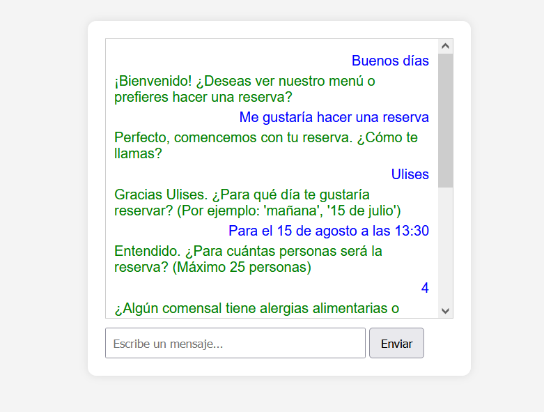

# Chatbot Básico con Django y PLN para Gestión de Reservas

Este proyecto es un **chatbot básico desarrollado con Django** que utiliza **procesamiento de lenguaje natural (PLN)** para gestionar reservas en un restaurante.  
El chatbot es capaz de entender entradas en lenguaje natural, procesar fechas, cantidades de personas y otros datos relevantes mediante el uso de la librería **spaCy**.




---

## 🚀 Instrucciones de Instalación y Ejecución

### ✅ Requisitos previos

Antes de empezar, asegúrate de tener instalado:

- Python 3.11 (o compatible)
- Pipenv
- Git
- Un editor de código como VSCode (opcional)

---

## 📥 Clonar el repositorio

```bash
git clone https://github.com/Alazib/chatBot_Django.git
```

---

## 📂 Acceder al proyecto

```bash
cd chatBot_Django
```

---

## 🐍 Crear el entorno virtual e instalar dependencias

```bash
pipenv install
```

> Este comando crea el entorno virtual y descarga automáticamente todas las dependencias del proyecto indicadas en el `Pipfile.lock`.

---

## 🌍 Instalar el modelo de spaCy (español)

```bash
python -m spacy download es_core_news_sm
```

> Este modelo es necesario para que el chatbot entienda y procese el texto en español.

---

## 🛠️ Activar el entorno virtual

```bash
pipenv shell
```

> Esto activa el entorno virtual creado específicamente para este proyecto.

---

## 🗄️ Aplicar las migraciones de la base de datos

```bash
python manage.py migrate
```

> Esto crea las tablas necesarias en la base de datos SQLite incluida en el proyecto.

---

## 🔐 Crear un superusuario (opcional)

```bash
python manage.py createsuperuser
```

> Esto te permitirá acceder al panel de administración de Django.

---

## 🚀 Ejecutar el servidor

```bash
python manage.py runserver
```

> El servidor se iniciará en la dirección:

```
http://127.0.0.1:8000
```

---

## 💬 Acceder al chatbot

Abre en el navegador:

```
http://127.0.0.1:8000/chatbot/
```

> Aquí podrás interactuar con el chatbot y probar las funcionalidades de reserva.

---

## ✅ Buenas prácticas

- Activar siempre el entorno virtual con:

```bash
pipenv shell
```

- No subir la carpeta `.venv` al repositorio.
- Si se agregan nuevas librerías, instalarlas con:

```bash
pipenv install nombre_paquete
```

---

## 📄 Notas adicionales

- Este es un proyecto básico de ejemplo para aprender a integrar Django con procesamiento de lenguaje natural (spaCy).
- Está preparado para trabajar en **modo local** y no está optimizado para despliegue en producción.
